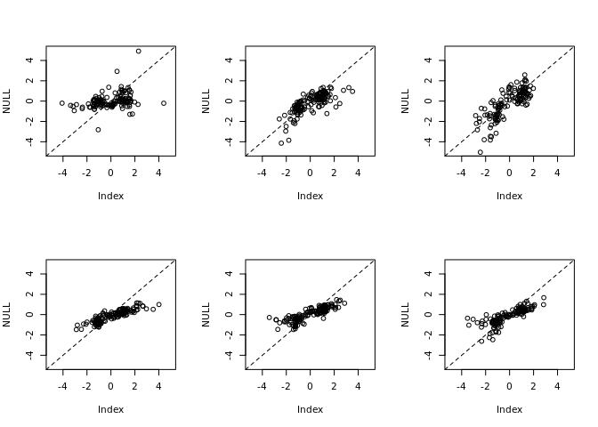
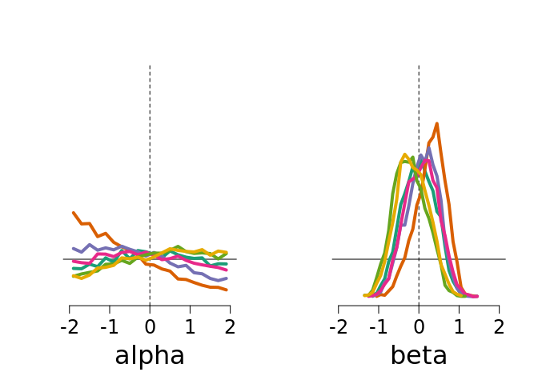
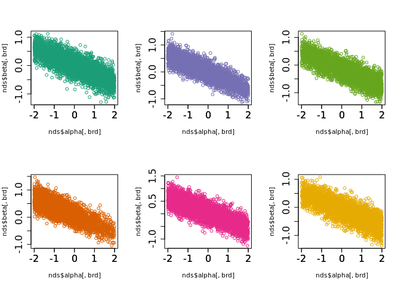

``` r
rm(list=ls())
library('R2jags')
```

    ## Loading required package: rjags

    ## Loading required package: coda

    ## Linked to JAGS 4.3.0

    ## Loaded modules: basemod,bugs

    ## 
    ## Attaching package: 'R2jags'

    ## The following object is masked from 'package:coda':
    ## 
    ##     traceplot

``` r
source("src/pigeon_helpers.R")

data <- pigeons_to_jags()
```

``` r
options(repr.plot.width  = 15,
        repr.plot.height = 10)

layout(matrix(1:6, nrow=2))

for(bb in unique(data$pigeons$bird)){
    brd_data <- subset(data$pigeons, bird==bb)
    plot(NULL, xlim=c(-5,5), ylim=c(-5,5))
    abline(0, 1, lty='dashed')
    points(log(brd_data$n_reinf_right/brd_data$n_reinf_left),
           log(brd_data$n_resp_right/brd_data$n_resp_left))
}
```



``` r
priors <- list(mean_alpha = 0.0,
               sd_alpha   = 1/sqrt(.1),
               mean_beta  = 0.0,
               sd_beta    = 1/sqrt(.1),
               shape_tau  = 2.0,
               rate_tau   = 0.5)

observed <- list(
    Br               = data$pigeons$n_resp_right,
    Bl               = data$pigeons$n_resp_left,
    Wr               = data$pigeons$n_reinf_right,
    Wl               = data$pigeons$n_reinf_left,
    birds            = data$birds,
    mean_alpha_prior = priors$mean_alpha,
    sd_alpha_prior   = priors$sd_alpha,
    mean_beta_prior  = priors$mean_beta,
    sd_beta_prior    = priors$sd_beta,
    shape_tau_prior  = priors$shape_tau,
    rate_tau_prior   = priors$rate_tau,
    n_obs            = length(data$sessions),
    n_birds          = length(unique(data$birds))
)

unobserved <- c('alpha', 'beta', 'tau', 'lambda_Br', 'lambda_Bl', 'Br_post', 'Bl_post')

model.file.name = 'generative_matching_individual.bug'

write(
    'model{

        for(b in 1:n_birds) {
            alpha[b] ~ dnorm(mean_alpha_prior, pow(sd_alpha_prior, -2))T(-2,2)
            beta[b]  ~ dnorm(mean_beta_prior , pow(sd_beta_prior , -2))T(-2,2)
            tau[b]   ~ dgamma(shape_tau_prior, rate_tau_prior)T(0.01,)
        }
    
        for(i in 1:n_obs) {
            lambda_Br[i] ~ dlnorm( alpha[birds[i]]/2 + beta[birds[i]] * log(Wr[i])/2, tau[birds[i]])
            lambda_Bl[i] ~ dlnorm(-alpha[birds[i]]/2 - beta[birds[i]] * log(Wl[i])/2, tau[birds[i]])
            Br[i] ~ dpois(lambda_Br[i])
            Bl[i] ~ dpois(lambda_Bl[i])
            Br_post[i] ~ dpois(lambda_Br[i])
            Bl_post[i] ~ dpois(lambda_Bl[i])
        }

    }',
    model.file.name
)

bayes <- jags(
    data = observed,
    parameters.to.save = unobserved,
    model.file = model.file.name, n.iter = 20000, n.chains = 4, n.burnin = 100
)
```

    ## module glm loaded

    ## Compiling model graph
    ##    Resolving undeclared variables
    ##    Allocating nodes
    ## Graph information:
    ##    Observed stochastic nodes: 1682
    ##    Unobserved stochastic nodes: 3382
    ##    Total graph size: 9163
    ## 
    ## Initializing model

``` r
summary(bayes$BUGSoutput$summary[,c('Rhat','n.eff')])
```

    ##       Rhat           n.eff     
    ##  Min.   :1.001   Min.   : 670  
    ##  1st Qu.:1.001   1st Qu.:3100  
    ##  Median :1.001   Median :4200  
    ##  Mean   :1.002   Mean   :3611  
    ##  3rd Qu.:1.001   3rd Qu.:4200  
    ##  Max.   :1.074   Max.   :4200

``` r
nds <- bayes$BUGSoutput$sims.list
summary(nds$alpha)
```

    ##        V1                 V2                V3                V4         
    ##  Min.   :-1.99715   Min.   :-2.0000   Min.   :-1.9998   Min.   :-1.9998  
    ##  1st Qu.:-0.82991   1st Qu.:-1.5293   1st Qu.:-1.2108   1st Qu.:-1.0067  
    ##  Median : 0.03691   Median :-0.9255   Median :-0.4450   Median :-0.1313  
    ##  Mean   : 0.03744   Mean   :-0.7198   Mean   :-0.3343   Mean   :-0.0872  
    ##  3rd Qu.: 0.92640   3rd Qu.:-0.1036   3rd Qu.: 0.4350   3rd Qu.: 0.8038  
    ##  Max.   : 1.99963   Max.   : 1.9982   Max.   : 1.9995   Max.   : 1.9998  
    ##        V5                V6         
    ##  Min.   :-1.9989   Min.   :-1.9971  
    ##  1st Qu.:-0.6491   1st Qu.:-0.6084  
    ##  Median : 0.2994   Median : 0.3368  
    ##  Mean   : 0.2155   Mean   : 0.2491  
    ##  3rd Qu.: 1.1000   3rd Qu.: 1.1669  
    ##  Max.   : 1.9993   Max.   : 1.9997

``` r
summary(nds$beta)
```

    ##        V1                  V2                 V3                V4          
    ##  Min.   :-1.290133   Min.   :-1.04512   Min.   :-1.1215   Min.   :-1.25987  
    ##  1st Qu.:-0.304342   1st Qu.: 0.04866   1st Qu.:-0.1821   1st Qu.:-0.22937  
    ##  Median : 0.004540   Median : 0.32980   Median : 0.1056   Median : 0.08017  
    ##  Mean   :-0.005016   Mean   : 0.29018   Mean   : 0.0842   Mean   : 0.07005  
    ##  3rd Qu.: 0.300197   3rd Qu.: 0.55891   3rd Qu.: 0.3760   3rd Qu.: 0.36742  
    ##  Max.   : 1.119614   Max.   : 1.46667   Max.   : 1.4141   Max.   : 1.44379  
    ##        V5                 V6         
    ##  Min.   :-1.34104   Min.   :-1.3637  
    ##  1st Qu.:-0.51669   1st Qu.:-0.4452  
    ##  Median :-0.23515   Median :-0.1745  
    ##  Mean   :-0.22352   Mean   :-0.1608  
    ##  3rd Qu.: 0.06016   3rd Qu.: 0.1281  
    ##  Max.   : 1.13139   Max.   : 1.0733

``` r
layout(matrix(1:2,nrow=1))

plot_marginal('alpha', nds)
plot_marginal('beta', nds)
```



``` r
layout(matrix(1:2,nrow=1))

plot_marginal <- function(){
  par(cex.axis=1.5)
  layout(matrix(1:6,ncol=3))
  for(brd in 1:6){
    plot(nds$alpha[,brd],nds$beta[,brd],col=bird_colors[brd])
    axis(1)
  }
}
plot_marginal()
```


